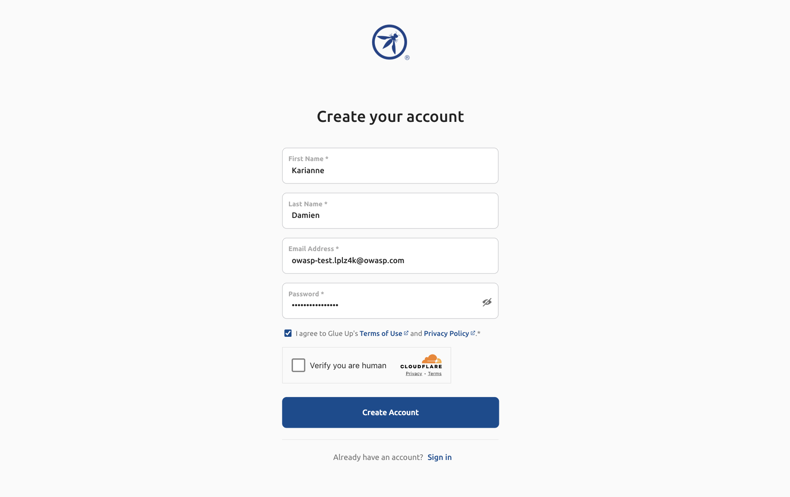
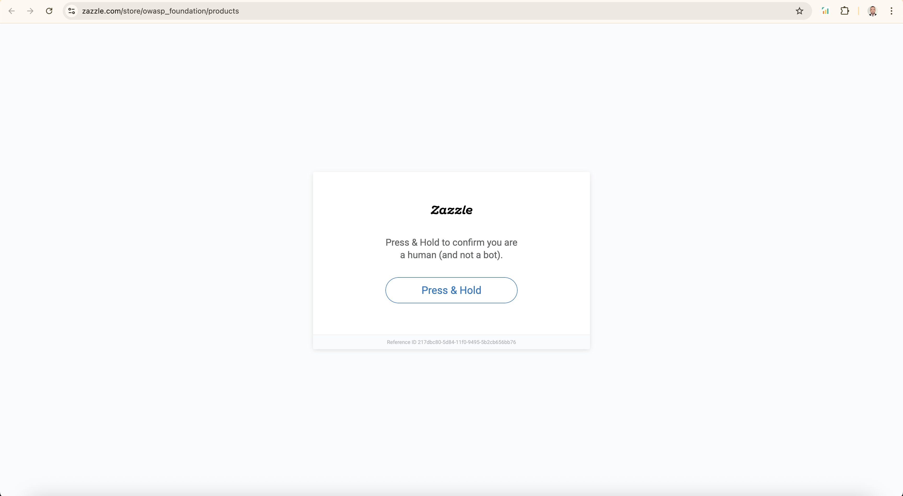

# OWASP Tests

Automated testing suite for OWASP website using Cypress.

## Prerequisites

- Node.js (v16 or higher)
- npm or yarn

## Setup

1. Install dependencies:

```bash
npm install
```

2. Run tests:

On headed mode:

```bash
npm run cy:open
```

All tests on headless mode:

```bash
npm run cy:run
```

Specific test on headless mode:

```bash
npm run cy:run -- --spec "cypress/e2e/user_registration.spec.cy.js"
```

## Tests

- **User Registration**: Tests the user registration flow on OWASP platform with dynamic data
- **User Login**: Tests user authentication functionality with existing user
- **Add to Cart**: Tests product selection and cart management features

## Structure

- `cypress/e2e/` - Test specs
- `cypress/locators/` - Element locators in JSON format
- `cypress/fixtures/` - Test data inputs and expected results
- `cypress/support/` - Custom commands and utilities

## Test Reports

Cypress generates HTML reports after test execution. To view reports:

```bash
npm run cy:run
```

Reports are saved in `cypress/reports/html/` as HTML files.

## CI/CD Pipeline

GitHub Actions pipeline automatically runs tests on push/PR to main branch. The pipeline:

- Runs all Cypress tests in headless mode
- Uploads HTML reports as artifacts

[View latest pipeline run](https://github.com/yassermouahid/owasp-tests/actions/runs/16195703646)

## Known Issues

- **User Registration**: Incomplete due to captcha

  

- **User Login**: Cannot test with a new registered user due to incomplete registration process

- **Add to Cart**: Skipped due to captcha

  
